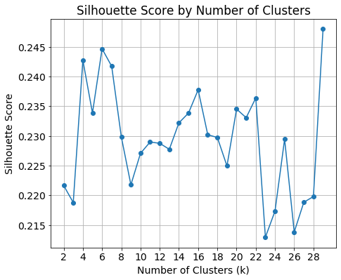
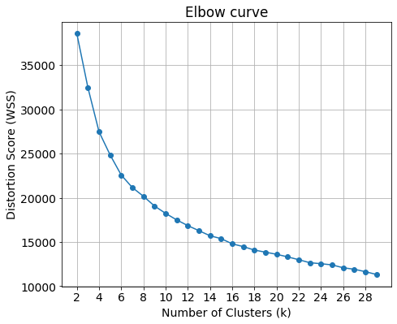
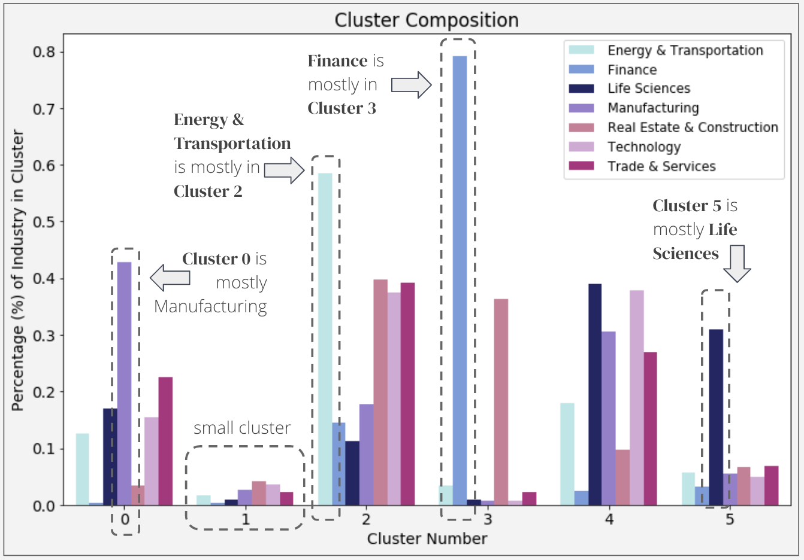

# Financials For Dummies
Clustering Publicly Listed Companies Based on Financial Ratios. Or, financial ratio analysis so simple, even an AI can do it.

## Background
One way equity researchers evaluate whether companies are a buy, hold, or sell is calculating financial ratios and comparing those calculated ratios to industry averages. Financial ratios are calculated based on publically available information such as a company's balance sheet line items (e.g. Long-Term-Debt-to- Total-Assets ratio), cash flow or income statement line items (e.g. Profit Margin), or the price of the stock (e.g. Price-to-Book ratio). 

These ratios by themselves are usually neither good nor bad, and the determination if a company is doing well depends on how that company's financial ratios compare to the industry average. This is because the industry or line of business greatly affects how a company is structured, which affects the size and composition of its financials.

## Business Problem
As the technology industry continues to be trendy, more companies are claiming to be "tech" companies despite their financials pointing to something different. One recent, [notable example is WeWork](https://hbr.org/2019/08/no-wework-isnt-a-tech-company-heres-why-that-matters), which saw its valuation plummet once its financials were disclosed in advance of its anticipated IPO. 

I wanted to use Machine Learning to identify companies that are similar to each other based on their financials—irrespective of industry—and see how closely those groups correspond to assigned industries. I also wanted to visually map all companies so we can investigate similar companies and see if we can identify how well a company is doing.

## Dataset

The data was sourced from EDGAR (Electronic Data Gathering, Analysis, and Retreival system) available at the SEC (Securities Exchange Commision) website. I downloaded the most recently available 10-Q fillings, which were June 2018 at the time. It contained the Balance Sheets, Income Statements, and Cash Flow Statements for 4,000+ publicly traded and listed companies.

## Features

Using the available financials, I engineered the following features:

- Profitability Ratios - Ability to generate profits relative to company size
    - ROA (Return on Assets)
    - ROE (Return on Equity)
    - Profit Margin

- Leverage Ratios - How levered is a company relative to its capital?
    - Equity Multiplier
    - Fixed Assets to Net Worth
    - Debt to Net Worth

- Efficiency Ratios - How efficient is a company at turning its assets into profits?
    - Asset Turnover
    - Inventory Turnover
    - Days Receivable
 
- Liquidity Ratios - Ability to meet short term obligations
    - Quick Ratio

## K-Means Clustering Model

For K-Means Clustering, I chose 6 clusters based on the Silhouette Score and distortion score (Elbow curve):

- High silhouette scores indicate companies are well matched within clusters
- 6 Clusters has a relatively high silhouette score

- Low distortion score indicates smaller squared distances from each point to its center
- Elbow not clearly defined, but 6 Clusters decreases distortion while keeping parsimony given # of clusters

## Cluster Results
### Cluster Composition

### Visualizing the Clusters - 3D

I used Principal Component Analysis (PCA) to reduce the dimensionality and graph the clusters
- The first 3 components of the PCA explained 63% of the variance in our financial ratios
- For comparison, the first 2 components explain 50%
### Visualizing the Clusters - 2D

